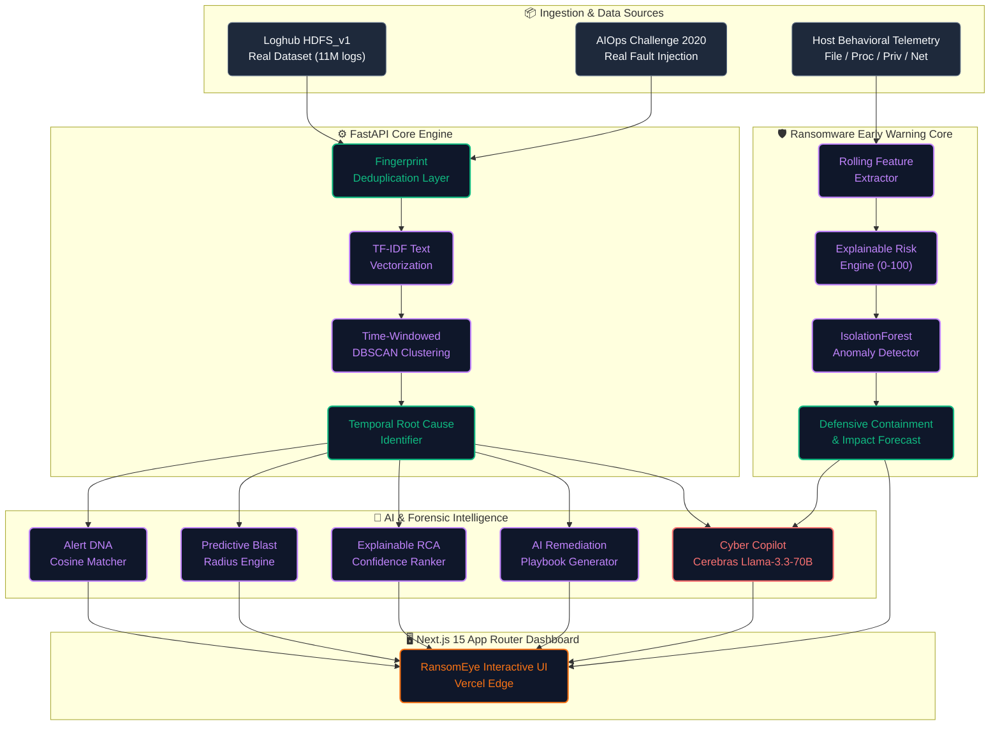

<div align="center">

# 🛡️ RansomEye

### Next-Gen Ransomware Early Warning & Intelligent Alert Correlation Engine

> **Detecting ransomware kill chains before encryption occurs — and collapsing infrastructure alert storms into single, actionable incidents.**

[](#-getting-started)
[](https://fastapi.tiangolo.com)
[](https://nextjs.org)
[](https://python.org)
[](https://cerebras.ai)
[](https://render.com)

<br/>

<kbd>

</kbd>
&nbsp;
<kbd>

</kbd>
&nbsp;
<kbd>

</kbd>
&nbsp;
<kbd>

</kbd>

<br/>
<br/>

</div>

---

## 📋 Table of Contents

- [🌟 Executive Summary](#-executive-summary)
- [🛡️ Core 1: Ransomware Early Warning System](#️-core-1-ransomware-early-warning-system)
- [⚡ Core 2: Intelligent Alert Correlation & Deduplication Engine](#-core-2-intelligent-alert-correlation--deduplication-engine)
- [🔬 Mathematical & Machine Learning Foundations](#-mathematical--machine-learning-foundations)
- [🏗️ System Architecture](#️-system-architecture)
- [🔍 Pipeline Deep Dive](#-pipeline-deep-dive)
- [⚡ RansomEye vs. Traditional Tooling](#-ransomeye-vs-traditional-tooling)
- [✨ Feature Matrix](#-feature-matrix)
- [🛠️ Technology Stack](#️-technology-stack)
- [📁 Project Structure](#-project-structure)
- [🚀 Getting Started](#-getting-started)
- [🌐 Production Deployment](#-production-deployment)
- [📊 Supported Datasets](#-supported-datasets)
- [✅ Feature Roadmap](#-feature-roadmap)
- [🤝 Acknowledgments](#-acknowledgments)

---

## 🌟 Executive Summary

Modern enterprise security and SRE teams face two crippling challenges:

1. **Ransomware Attacks execute in seconds.** Traditional EDRs often react *after* widespread file encryption or volume shadow copy deletion has already occurred.
2. **Alert Storms paralyze SOC & SRE responders.** A single root-cause infrastructure fault (e.g., database timeout) generates hundreds of downstream cascading alerts within minutes, burning critical response time.

**RansomEye solves both sides of the operational coin in a unified cyber-defense platform:**

```
                  ┌─────────────────────────────────────────────────────────────┐
                  │                      RANSOMEYE PLATFORM                     │
                  └──────────────────────────────┬──────────────────────────────┘
                                                 │
                  ┌──────────────────────────────┴──────────────────────────────┐
                  ▼                                                             ▼
┌───────────────────────────────────────────┐ ┌───────────────────────────────────────────┐
│     🛡️ RANSOMWARE EARLY WARNING MODULE    │ │   ⚡ ALERT CORRELATION & DEDUP ENGINE     │
├───────────────────────────────────────────┤ ├───────────────────────────────────────────┤
│ • Real-time host behavioral telemetry     │ │ • 12-stage automated alert pipeline       │
│ • File entropy & mass churn tracking      │ │ • Fingerprint hashing & 5-min window dedup│
│ • Shadow copy & process elevation flags   │ │ • TF-IDF + DBSCAN density clustering      │
│ • Explainable 0–100 risk score engine     │ │ • Temporal root cause identification      │
│ • IsolationForest anomaly validation      │ │ • Alert DNA historical incident matching  │
│ • Approval-gated automated containment    │ │ • AI Remediation Playbooks & SRE runbooks │
│ • +5m/+10m/+15m encryption impact forecast│ │ • Blast radius prediction & interactive DAG│
└───────────────────────────────────────────┘ └───────────────────────────────────────────┘
```

---

## 🛡️ Core 1: Ransomware Early Warning System

RansomEye monitors multi-vector telemetry across host endpoints to catch ransomware activity in the **pre-encryption staging phase**.

```
Host Telemetry Ingestion ──► Feature Windowing ──► Weighted Risk Engine ──► Anomaly Validation ──► Early Warning Alert ──► Defensive Containment
```

### Key Capabilities

| Capability | Technical Implementation | Value to SOC Security Analysts |
|:---|:---|:---|
| **📁 File-System Churn** | Tracks modification, creation, rename, and deletion rates alongside extension entropy shifts | Catches mass renaming and format-independent file encryption flips before disk saturation |
| **⚙️ Process Behavior** | Monitors suspicious process spawning (`vssadmin.exe`, `bcdedit.exe`, encoded PowerShell, macro children) | Detects shadow copy deletion and recovery inhibition before files are locked |
| **🔐 Privilege Elevation** | Identifies token elevation, security service tampering, and administrative privilege escalation | Flags unauthorized credential theft and domain controller access attempts |
| **🌐 Network Telemetry** | Analyzes external connection spikes, bad-reputation IP hits, and C2 beaconing frequencies | Catches active data exfiltration and command-and-control communication |
| **🧠 Hybrid Risk Scoring** | Combines explainable 0–100 weighted risk heuristic with an `IsolationForest` ML anomaly score | Guarantees transparent auditability while catching novel zero-day behavioral anomalies |
| **🔮 Impact Forecast** | Computes +5m, +10m, +15m projected encrypted file count, compromised processes, and data volume at risk | Gives incident commanders real-time predictive visibility into potential blast radius |
| **🛡️ Approval-Gated Containment** | Generates non-destructive (auto-executed) and high-impact (approval-gated) containment plans | Enables instant process suspension and endpoint network isolation without accidental downtime |
| **🤖 Cyber SOC Copilot** | Powered by **Cerebras Llama-3.3-70B** with real-time telemetry context injection | Provides plain-English threat summaries, MITRE ATT&CK mapping, and interactive investigator chat |

### Reproducible Demo Scenarios

RansomEye includes three seeded, one-click demo scenarios available directly at `/`:

- 🟢 **`NORMAL_ACTIVITY`**: Standard workplace telemetry baseline (office documents, browser activity, routine software updates).
- 🟡 **`SUSPICIOUS_ACTIVITY`**: High-volume backup/archiving script execution — acts as the **false-positive control** (high file churn but zero ransomware tradecraft signatures).
- 🔴 **`RANSOMWARE_ATTACK`**: Full kill-chain simulation — process injection $\rightarrow$ shadow copy deletion $\rightarrow$ C2 beaconing $\rightarrow$ rapid entropy flip & mass rename.

---

## ⚡ Core 2: Intelligent Alert Correlation & Deduplication Engine

When infrastructure incidents occur, IT systems flood monitoring tools with repetitive alerts. RansomEye's correlation engine collapses alert noise by **up to 95%** in real time.

```
Raw Alerts (150+) ──► Fingerprint Dedup ──► TF-IDF Embedding ──► DBSCAN Clustering ──► Root Cause RCA ──► Correlated Incident (1)
```

### The Problem: Alert Storms
```
┌──────────────────────────────────────────────────────────────────┐
│                    CRITICAL DATABASE TIMEOUT                     │
│                                │                                 │
│              ┌─────────────────┼─────────────────┐               │
│              ▼                 ▼                 ▼               │
│        ┌───────────┐     ┌───────────┐     ┌───────────┐         │
│        │ API GW    │     │ Order Svc │     │ Auth Svc  │         │
│        │ 504 Error │     │ Retry Fail│     │ Token Error│        │
│        │ ×45       │     │ ×60       │     │ ×50       │         │
│        └───────────┘     └───────────┘     └───────────┘         │
│              │                 │                 │               │
│              └─────────────────┼─────────────────┘               │
│                                ▼                                 │
│         155 RAW ALERTS IN 3 MINUTES — SREs OVERWHELMED          │
└──────────────────────────────────────────────────────────────────┘
```

### The Solution: RansomEye Intelligent Correlation
RansomEye processes the alert stream, hashes identical alerts within time windows, clusters semantic similarities using DBSCAN, isolates the root cause (earliest propagation timestamp), and generates a ready-to-execute SRE remediation playbook.

---

## 🔬 Mathematical & Machine Learning Foundations

### 1. Ransomware Risk Engine Formula
The host risk score $R_{\text{endpoint}} \in [0, 100]$ is computed using an explainable weighted heuristic corroborated by an unsupervised anomaly baseline:

$$R_{\text{endpoint}} = w_F \cdot S_{\text{file}} + w_P \cdot S_{\text{proc}} + w_E \cdot S_{\text{priv}} + w_N \cdot S_{\text{net}}$$

Where:
- $w_F = 0.35$ (File-system churn & entropy flip weight)
- $w_P = 0.25$ (Process tradecraft & shadow-copy deletion weight)
- $w_E = 0.20$ (Privilege escalation & credential theft weight)
- $w_N = 0.20$ (Network C2 beaconing & exfiltration weight)

The score is cross-validated with an **IsolationForest Anomaly Model**:

$$\text{Score}_{\text{anomaly}} = 100 \cdot \max\left(0, 1 - 2^{\frac{-\mathbb{E}(h(x))}{c(n)}}\right)$$

### 2. Alert Deduplication Fingerprinting
Alerts are hashed into deduplication buckets across sliding 5-minute time windows:

$$\text{Fingerprint}(a) = \text{MD5}\Big(a.\text{service} \;\|\; a.\text{alertname} \;\|\; \lfloor a.\text{timestamp} / 300 \rfloor\Big)$$

### 3. Semantic TF-IDF + Density DBSCAN Clustering
Alert descriptions $d \in D$ are embedded into TF-IDF vector space:

$$\text{TF-IDF}(t, d, D) = \text{TF}(t, d) \times \log\left(\frac{|D|}{|\{d' \in D : t \in d'\}|}\right)$$

Using cosine distance $d(u, v) = 1 - \frac{u \cdot v}{\|u\|_2 \|v\|_2}$, time-windowed **DBSCAN** forms cluster partitions $\mathcal{C}_k$:

$$\mathcal{N}_{\varepsilon}(p) = \{q \in D \mid \text{dist}(p, q) \le \varepsilon \land |t_p - t_q| \le \Delta T_{\text{window}}\}$$

### 4. Correlation Escalation Risk Score
The incident escalation risk $E_{\text{cluster}} \in [0.0, 1.0]$ calculates blast expansion rate:

$$E_{\text{cluster}} = 0.40 \cdot \text{GrowthRate} + 0.35 \cdot \text{SeverityWeight} + 0.25 \cdot \text{ServiceSpread}$$

---

## 🏗️ System Architecture



---

## 🔍 Pipeline Deep Dive

Each telemetry event and alert passes through a **12-stage end-to-end pipeline**:

| Stage | Name | Architecture & Algorithm | Output Artifact | Key Code Files |
|:---:|:---|:---|:---|:---|
| **1** | **Ingestion** | Multi-source loader supporting Loghub HDFS_v1, AIOps Challenge 2020, and host telemetry generators | Normalized Alert Stream | `data/synthetic_alert_generator.py`<br>`data/loghub_hdfs_loader.py` |
| **2** | **Deduplication** | MD5 fingerprint hashing of `(service, alertname, 5-min window)` | Deduplicated Alert Stream | `backend/app/dedup.py` |
| **3** | **Vectorization** | TF-IDF text vectorization over alert payloads & messages | Sparse Feature Vectors | `backend/app/clustering.py` |
| **4** | **Correlation** | Time-windowed DBSCAN density-based spatial clustering | Incident Clusters | `backend/app/clustering.py` |
| **5** | **Root Cause Analysis** | Earliest timestamp extraction & causal dependency graph ordering | Root Cause Alert Tag | `backend/app/clustering.py` |
| **6** | **Risk Scoring** | Normalized heuristic: `0.40·growth + 0.35·severity + 0.25·spread` | Escalation Risk (0.0–1.0) | `backend/app/risk_score.py` |
| **7** | **Alert DNA** | Cosine similarity comparison against historical incident knowledge base | Past Incident Matches | `backend/app/alert_dna.py` |
| **8** | **LLM Copilot** | Cerebras API inference with Llama-3.3-70B model | Natural Language Summary | `backend/app/summarizer.py`<br>`backend/app/assistant.py` |
| **9** | **Blast Radius** | Linear projection & cascade horizon forecasting (+5m, +10m, +15m) | Blast Radius Forecast | `backend/app/forecast.py` |
| **10** | **RCA Confidence** | Multi-signal explainable XAI confidence score with rejection reasons | RCA Confidence % | `backend/app/root_cause_confidence.py` |
| **11** | **Playbook Gen** | Step-by-step SRE runbooks with interactive terminal execution mode | Interactive Playbook | `backend/app/playbook.py` |
| **12** | **Evaluation** | Real-time accuracy metrics: Precision, Recall, F1, MTTR savings | Pipeline Metrics | `backend/app/main.py` |

---

## ⚡ RansomEye vs. Traditional Tooling

| Feature / Metric | Legacy SIEM / Rules Engine | Traditional EDR Tooling | RansomEye Cyber-Defense |
|:---|:---:|:---:|:---:|
| **Detection Speed** | Reactive (post-log indexing) | Post-signature execution | **Pre-encryption behavioral staging** |
| **Alert Reduction Rate** | 0% (Raw log ingestion) | 10%–20% (Endpoint grouped) | **> 90% Noise Reduction** |
| **Root Cause Identification** | Manual log searching | Limited to host processes | **Automated Temporal & Topology RCA** |
| **Risk Explainability** | Black-box severity | Static threat score | **Explainable Weighted Signal Breakdown** |
| **Historical Incident Matching** | Manual query searching | None | **Automated Alert DNA Cosine Matching** |
| **Remediation Capabilities** | Manual playbooks | Rigid auto-quarantine | **Approval-Gated Safe Containment** |
| **AI Investigator Assistant** | Static chatbot / None | Basic summary | **Cerebras Llama-3.3-70B Context Copilot** |

---

## ✨ Feature Matrix

<table width="100%">
<tr>
<td width="50%" valign="top">

### 🛡️ Ransomware Early Warning
- 🔬 **Multi-Vector Telemetry Tracking**: File, process, privilege, network.
- 📈 **Entropy Flip Detection**: Identifies plaintext-to-ciphertext transitions.
- 🚫 **Shadow Copy Protection**: Detects `vssadmin` and recovery removal.
- 🔮 **+15m Impact Forecast**: Projects encrypted file count & compromised data.
- ⚡ **Approval-Gated Containment**: Non-destructive auto-execution & gated isolation.
- 💬 **Cyber SOC Copilot**: AI assistant powered by Cerebras Llama-3.3-70B.

</td>
<td width="50%" valign="top">

### ⚡ Intelligent Alert Correlation
- 🎯 **Fingerprint Deduplication**: Collapses 5-min alert spikes.
- 🧮 **TF-IDF + DBSCAN Clustering**: Fast semantic alert grouping.
- 📍 **Root Cause Identification**: Isolates originating service failure.
- 🧬 **Alert DNA Matching**: Cosine similarity to historical incidents.
- 📊 **Explainable RCA (XAI)**: Rejection reasons for candidate services.
- 🗺️ **Interactive Topology DAG**: Visualizes service dependencies.

</td>
</tr>
<tr>
<td width="50%" valign="top">

### 🛠️ SRE & Incident Response
- 📋 **AI Remediation Playbooks**: Detailed step-by-step SRE runbooks.
- 💻 **Interactive Terminal Simulator**: Dry-run remediation commands safely.
- ⏳ **Incident Time Machine**: Step-through forensic replay of alert cascades.
- 🔍 **Historical Comparator**: Git PR-style visual diff between incidents.

</td>
<td width="50%" valign="top">

### 📊 Datasets & Evaluation
- 🎲 **Synthetic Chaos Injector**: 5 failure scenarios with ground-truth labels.
- 📦 **Loghub HDFS_v1 Dataset**: Real-world HDFS block anomaly logs.
- 🏭 **AIOps Challenge 2020**: Production fault injection dataset.
- 📉 **Pipeline Evaluation Dashboard**: Real-time Precision, Recall, F1, & MTTR.

</td>
</tr>
</table>

---

## 🛠️ Technology Stack

<table>
<tr>
<td valign="top" width="50%">

### Backend & Data Science Engine
- **Language**: Python 3.9+
- **API Framework**: [FastAPI](https://fastapi.tiangolo.com/) (Async, Pydantic v2)
- **Machine Learning**: [Scikit-Learn](https://scikit-learn.org/) (TF-IDF, DBSCAN, IsolationForest)
- **Numerical Computing**: NumPy, Pandas
- **Persistence**: SQLAlchemy + SQLite
- **LLM Provider**: [Cerebras API](https://cerebras.ai) (Llama-3.3-70B inference)

</td>
<td valign="top" width="50%">

### Frontend & Visualization Dashboard
- **Framework**: [Next.js 15](https://nextjs.org/) (App Router, React 19)
- **Styling**: Tailwind CSS (Dark theme aesthetics)
- **UI Components**: Headless UI, Tremor Components
- **Graph & Topology**: React Flow, Dagre DAG layout
- **Deployment & Edge**: Vercel Edge Rewrites

</td>
</tr>
</table>

---

## 📁 Project Structure

```
RansomEye/
├── backend/
│   ├── app/
│   │   ├── main.py                  # FastAPI application entrypoint & correlation routes
│   │   ├── dedup.py                 # Fingerprint deduplication engine
│   │   ├── clustering.py            # TF-IDF vectorizer + DBSCAN clustering engine
│   │   ├── risk_score.py            # Correlation escalation risk calculator
│   │   ├── alert_dna.py             # Cosine similarity alert DNA matcher
│   │   ├── forecast.py              # 15-minute blast radius forecast model
│   │   ├── root_cause_confidence.py # Explainable XAI confidence ranking
│   │   ├── playbook.py              # SRE remediation playbook generator
│   │   ├── summarizer.py            # LLM incident summarizer (Cerebras Llama-3.3)
│   │   ├── assistant.py             # Interactive AI Copilot assistant
│   │   ├── db.py                    # SQLAlchemy persistence layer
│   │   ├── models.py               # Pydantic data schemas
│   │   └── ransomeye/               # Ransomware Early Warning Detection Core
│   │       ├── telemetry.py         # Multi-vector host event generator
│   │       ├── features.py          # Rolling feature window extractor
│   │       ├── detector.py          # Dual Baseline + IsolationForest anomaly detector
│   │       ├── risk_engine.py       # Explainable 0-100 ransomware risk calculator
│   │       ├── alerts.py            # Deduplicated endpoint early-warning alerts
│   │       ├── forecast.py          # +5m/+10m/+15m encryption impact forecast engine
│   │       ├── containment.py       # Approval-gated defensive containment generator
│   │       ├── copilot.py           # Cyber SOC analyst copilot bridge
│   │       ├── demo.py              # Scenario orchestrator (NORMAL/SUSPICIOUS/RANSOMWARE)
│   │       └── api.py               # FastAPI router (/ransomeye/*)
│   └── requirements.txt             # Python dependencies
│
├── data/
│   ├── synthetic_alert_generator.py # 5 cascading synthetic failure scenario generator
│   ├── loghub_hdfs_loader.py        # Loghub HDFS_v1 dataset parser & cache loader
│   ├── aiops_challenge_loader.py    # AIOps Challenge 2020 loader
│   └── seed_incident_library.json   # Historical incident DNA knowledge base
│
├── frontend-next/                   # Next.js 15 Production Web Application
│   ├── app/(keep)/                  # App Router pages
│   │   ├── feed/                    # Live Alert Feed view
│   │   ├── incidents/               # Correlated Incident details & PR comparator
│   │   ├── correlations/            # DBSCAN cluster visualization
│   │   ├── deduplication/           # Deduplication performance dashboard
│   │   ├── topology/               # Interactive service dependency DAG
│   │   ├── forecast/               # Blast radius projections
│   │   ├── timemachine/            # Forensic incident step-replay
│   │   ├── evaluation/             # Pipeline metrics (Precision, Recall, F1)
│   │   └── ransomware/             # Ransomware Early Warning Dashboard
│   ├── entities/                    # TypeScript domain entities
│   └── components/                  # Reusable UI components & modals
│
├── render.yaml                      # Render zero-cost blueprint deployment spec
├── notebooks/                       # PoC Jupyter research notebooks
└── README.md                        # Documentation
```

---

## 🚀 Getting Started

### Prerequisites

| Requirement | Minimum Version | Recommended |
|:---|:---:|:---:|
| **Python** | `3.9+` | `3.11` |
| **Node.js** | `18.0.0+` | `20.x` |
| **npm** | `9.0.0+` | `10.x` |
| **Cerebras API Key** | Optional | Recommended (For AI Copilot & Playbooks) |

---

### 1️⃣ Local Backend Installation

```bash
# 1. Clone repository
git clone https://github.com/Aditya-Khetawat/RANSOMEYE-CYBERSECURITY.git
cd RANSOMEYE-CYBERSECURITY

# 2. Install backend dependencies
pip install -r backend/requirements.txt

# 3. Configure environment variables (Optional)
echo "CEREBRAS_API_KEY=your_cerebras_key_here" > .env

# 4. Pre-cache real-world datasets (Optional, one-time)
python data/loghub_hdfs_loader.py
python data/aiops_challenge_loader.py

# 5. Launch FastAPI backend server
uvicorn app.main:app --app-dir backend --reload --port 8001
```

> 🟢 **Backend API Live at**: `http://localhost:8001`  
> 📖 **Interactive Swagger OpenAPI Specs**: `http://localhost:8001/docs`

---

### 2️⃣ Local Frontend Installation

```bash
# 1. Navigate to frontend directory
cd frontend-next

# 2. Install dependencies
npm install

# 3. Start Next.js development server with Turbopack
npm run dev
```

> 🟢 **Frontend Dashboard Live at**: `http://localhost:3000`

---

### 3️⃣ Quick Verification & Usage

1. Open `http://localhost:3000` in your browser.
2. Select any demo scenario on the home page to run live ransomware attack simulations (`RANSOMWARE_ATTACK` vs `SUSPICIOUS_ACTIVITY`).
3. Switch datasets on the **Alert Feed** to execute real-time alert deduplication and correlation over 11M+ log entries.

---

## 🌐 Production Deployment

RansomEye is optimized for **zero-cost, high-performance deployment**:

```
                       ┌─────────────────────────┐
                       │   Vercel Edge Network   │
                       │   (Next.js 15 Frontend) │
                       └────────────┬────────────┘
                                    │ Edge Middleware Proxy Rewrite
                                    ▼
                       ┌─────────────────────────┐
                       │  Render Cloud Service   │
                       │   (FastAPI Backend)     │
                       └─────────────────────────┘
```

### Option A: 1-Click Backend Deploy on Render

Click the button below to deploy the backend directly to Render using [`render.yaml`](./render.yaml):

[](https://render.com/deploy?repo=https://github.com/Aditya-Khetawat/RANSOMEYE-CYBERSECURITY)

- Reads `backend/requirements.txt`
- Configured for Python 3.11+
- Lightweight memory footprint (< 512MB RAM)

### Option B: Frontend Deploy on Vercel

1. Go to [Vercel Dashboard](https://vercel.com/new) $\rightarrow$ Import `RANSOMEYE-CYBERSECURITY`.
2. Set **Root Directory** to `frontend-next`.
3. Configure Environment Variables:
   - `API_URL` = `https://your-backend-name.onrender.com` (the Render service from Option A)
   - `NEXTAUTH_SECRET` = output of `openssl rand -hex 32`
   - `AUTH_TYPE` = `NO_AUTH`
   - `DISABLE_REDIRECTS` = `true`
4. Click **Deploy**.

> **Note:** the public demo link is redeployed per milestone. If a shared link
> looks stale, run locally (below) or redeploy — the code in `main` is current.

---

## 📊 Supported Datasets

| Dataset | Nature | Total Volume | Anomaly / Ground-Truth Labels | Usage |
|:---|:---:|:---:|:---:|:---|
| **Synthetic Chaos Engine** | Simulated | 120 alerts/batch | 5 cascading microservice scenarios | Instant PoC testing & pipeline verification |
| **Loghub HDFS_v1** | Real-World Logs | ~11M log lines | Block-level anomaly ground truth (Zenodo) | Large-scale AIOps benchmark validation |
| **AIOps Challenge 2020** | Production Faults | Multi-service alerts | Injected metric/log anomalies | Complex cascade evaluation |

---

## ✅ Feature Roadmap

- [x] **Ransomware Early Warning Core** (File entropy, process tradecraft, privilege elevation)
- [x] **Explainable 0–100 Weighted Risk Scoring Engine**
- [x] **IsolationForest ML Anomaly Verification**
- [x] **Approval-Gated Defensive Containment Generator**
- [x] **+15m Encryption Blast Horizon Forecasting**
- [x] **Fingerprint Deduplication Layer (5-min window hashing)**
- [x] **TF-IDF + DBSCAN Density Clustering Correlation Engine**
- [x] **Temporal Root Cause Analysis (RCA)**
- [x] **Alert DNA Past-Incident Cosine Similarity Matching**
- [x] **Cerebras Llama-3.3-70B AI Copilot Integration**
- [x] **AI Remediation Playbooks & Interactive Terminal Simulator**
- [x] **Incident Time Machine & Historical PR-Style Comparator**
- [x] **Interactive React Flow Service Topology DAG**
- [x] **Multi-Dataset Support (Synthetic, Loghub HDFS_v1, AIOps Challenge 2020)**
- [x] **Render & Vercel Production Infrastructure Deployment**

---

## 🤝 Acknowledgments

RansomEye was designed and built for next-generation cyber defense and enterprise AIOps incident automation.

---

<div align="center">

**⚡ RansomEye Cyber Security** — *See the attack. Prove it. Understand it. Predict it. Stop it.*

[](https://github.com/Aditya-Khetawat/RANSOMEYE-CYBERSECURITY)

</div>
